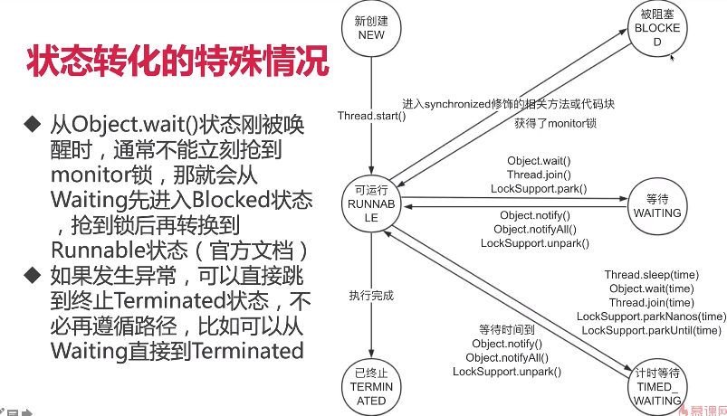

# 高频面试题 + 面试加薪技巧


## 一、大纲

1. 数十个面试常见问题、答题思路、参考答案
2. 从一个点引申出并发知识架构，展现知识储备和深刻理解，为面试加分
3. 单单把课程里面的并发常见面试题学会，也物有所值

## 二、面试题

1. ### Java有多少种实现多线程的方式

   答题思路,有以下5点: 

- 从不同的角度看,会有不同的答案；

- 典型答案是两种，分别是实现Runnable接口和继承Thread类，然后具体展开说；

- 但是我们看原理，其实Thread类实现了Runnable接口，并且看Thread类的run方法，会发现其实那两种本质都是一样的，run方法的代码如下：

  ```
  @overide
  public void run(){
  	if (target != null){
  		target.run();
  	}
  }
  ```

  方法一和方法二，也就是“继承Thread类然后重写run()”和“实现Runnable接口并传入Thread类”在实现多线程的本质上，并没有区别，都是最终调用start()方法来新建线程，这两个方法的最主要区别在于run()方法的内容来源：方法一最终调用的是target.run()方法，方法二中，run()整个都被重写；

- 然后具体展开说其他方式：还有其他的实现线程的方法，例如线程池等，他们也能新建线程，但是细看源码，从没有逃出过本质，也就是实现Runnable接口和继承Thread类；

- 结论：我们只通过新建Thread类这一种方式来创建线程，但是类里面的run方法有两种方式来实现，第一种是重写run方法，第二种实现Runnable接口的run方法，然后把该Runnable实例传给Thread类。除此之外，从表面上看线程池，定时器等工具类也可以创建线程，但是他们的本质都逃不出刚才所说的范围；

以上这种描述比直接回答一种、两种、多种更准确。


2. ### 实现Runnable接口和继承Thread类哪种方式更好？

- 从代码架构角度

- 新建线程的损耗

- Java不支持双继承

  

3. ### Thread中start方法的执行流程是什么？

- 检查线程状态，只有NEW状态下的线程才能start，否则会抛出java.lang.IllegalThreadStateException（在运行中或者已结束的线程，都不能再次启动）
- 加入线程组
- 调用start0方法启动线程

注意点：start方法是被synchronized修饰的方法，可以保证线程安全；由JVM创建的main方法线程和system组线程，并不会通过start来启动。


4. ### Java中停止线程的原则是什么？

   ​		在Java中，最好的停止线程的方式是使用终端interrupt，但是这仅仅是会通知到被终止的线程“你该停止运行了”，被终止的线程自身拥有决定权（决定是否以及何时停止），这依赖于请求停止方和被停止方都遵守一种约定好的编码规范。

   ​		任务和线程的启动很容易。在大多数时候，我们都会让他们运行直到结束，或者让它们自行停止。然而，有时候我们希望提前结束任务或线程，或许是因为用户取消了操作，或者服务需要被快速关闭，或者是运行超时或出错了。

   ​		要使任务和线程安全、快速、可靠地停止下来，并不是一件容易的事。Java没有提供任何机制来安全地终止线程，但它提供了中断（interruption），这是一种协作机制，能够使一个线程终止另一个线程的当前工作。

   ​		这种协作方式的方法是必要的，我们很少希望某个任务、线程或服务立即停止，因为这种立即停止会使共享的数据处于不一致的状态。相反，在编写任务和服务时可以使用一种协作的方式：当需要停止时，他们首先会清除当前正在执行的工作，然后再结束。这提供了更好的灵活性，因为任务本身的代码比发出取消请求的代码更清除如何执行清除工作。生命周期结束（End-of-Lifecycle）的问题会使任务、服务以及程序的设计和实现等过程变得负责，而这个程序设计中非常重要的要素却经常被忽略。一个在行为良好的软件与勉强运行的软件之间的最主要区别就是，行为良好的软件能很完善地处理失败、关闭和取消等过程。

   ​		本章将给出这种实现取消和中断的机制，以及如何编写任务和服务，使它们能对取消请求作出响应。

5. ### 如何停止线程？

- 原理：用interrupt来请求线程停止而不是强制，好处是安全；

- 想停止线程，要请求方、被停止方、子方法被调用方相互配合才行；

  a) 作为被停止方：每次循环中或者适时检查中断信号，并且在可能抛出InterruptedException的地方处理该中断信号；

  b) 请求方：发出中断信号；

  c) 子方法调用方（被线程调用的方法的作者）要注意：优先在方法层面抛出InterrupedException，或者检查到中断信号时，再次设置中断状态；

- 最后再说错误的方法：stop/suspend已废弃，volatile的boolean值无法处理长时间阻塞的情况。

6. ### 如何处理不可中断的阻塞？

   如果线程阻塞由于调用了wait,sleep,或join方法，你可以中断线程，通过抛出InterruptedException来唤醒该线程。但是对于不能响应InterruptedException的阻塞，很遗憾，并没有一个通用的解决方案。但是我们可以利用特定的其他的可以响应中断的方法，比如ReentrantLock.lockInterruptibly,比如关闭套接字使线程立即返回等方法来达到目的。答案有很多种，因为有很多原因会造成线程阻塞，所以针对不同情况，唤起的方法也不同。

   总结就是如果不支持响应中断，就要用特定方法来唤起，没有万能药。

7. ### 线程有哪些状态？

   先讲6个状态的状态名，再讲转换路径（例如：new只能跳转到runnable），最后将转移条件。

   




8. ### 手写生产者消费者设计模式

- 为什么要使用生产者消费者模式？

  将消费方和生产方进行了解耦，并且使得生产者和消费者更加流畅的配合。

- 通过wait和notify编写的生产者消费者模式

```
public class ProducerConsumerModel {

    public static void main(String[] args) {
        StorageHouse storageHouse = new StorageHouse();
        Producer producer = new Producer(storageHouse);
        Consumer consumer = new Consumer(storageHouse);
        new Thread(producer).start();
        new Thread(consumer).start();
    }

    private static class Producer implements Runnable {
        private final StorageHouse mStorageHouse;

        public Producer(StorageHouse mStorageHouse) {
            this.mStorageHouse = mStorageHouse;
        }

        @Override
        public void run() {
            while (true) {
                try {
                    Product product = new Product("product" + mStorageHouse.size(),
                            mStorageHouse.size());
                    mStorageHouse.put(product);
                } catch (InterruptedException e) {
                    System.out.println(e.toString());
                }
            }
        }
    }

    private static class Consumer implements Runnable {
        private final StorageHouse mStorageHouse;

        public Consumer(StorageHouse mStorageHouse) {
            this.mStorageHouse = mStorageHouse;
        }

        @Override
        public void run() {
            while (true) {
                try {
                    Product product = mStorageHouse.take();
                    System.out.println("Consume：" + product.toString());
                } catch (InterruptedException e) {
                    System.out.println(e.toString());
                }
            }
        }
    }


    private static class StorageHouse {
        private static final int MAX_NUM = 10;
        private final LinkedList<Product> mProducts = new LinkedList();

        public synchronized void put(Product product) throws InterruptedException {
            if (mProducts.size() == MAX_NUM) {
                wait();
            }
            mProducts.add(product);
            System.out.println("Produce：" + product.toString());
            notify();
        }

        public synchronized Product take() throws InterruptedException {
            if (mProducts.size() == 0) {
                wait();
            }
            Product product = mProducts.pollFirst();
            notify();
            return product;
        }

        public int size() {
            return mProducts.size();
        }
    }

    private static class Product {
        private final String name;
        private final int price;

        public Product(String name, int price) {
            this.name = name;
            this.price = price;
        }

        @Override
        public String toString() {
            return "Product{" +
                    "name='" + name + '\'' +
                    ", price=" + price +
                    '}';
        }
    }
}
```

### 9.两个线程交替打印0~100的奇偶数（synchronized实现方式）

```
/**
 * 两个线程交替打印0~100的奇偶数，用synchronized关键字实现
 *
 * 思路：新建两个线程，一个只处理偶数，一个只处理奇数（用位运算）。用synchronized来通信
 *
 * 缺点：涉及到多次对于锁的争夺，效率较低
 */
public class PrintOddEvenWithSync {
    private static final Object LOCK = new Object();
    private static final int LIMIT = 100;
    private static int count;

    public static void main(String[] args) {
        new Thread(new OddRunnable()).start();
        new Thread(new EvenRunnable()).start();
    }

    private static class OddRunnable implements Runnable {
        @Override
        public void run() {
            while (count < LIMIT) {
                synchronized (LOCK) {
                    if ((count & 1) == 1) {
                        System.out.println("奇数：" + count);
                        count++;
                    }
                }
            }
        }
    }

    private static class EvenRunnable implements Runnable {
        @Override
        public void run() {
            while (count <= LIMIT) {
                synchronized (LOCK) {
                    if ((count & 1) == 0) {
                        System.out.println("偶数：" + count);
                        count++;
                    }
                }
            }
        }
    }
}
```

### 10.两个线程交替打印0~100的奇偶数（Wait和Notify实现方式）

```
/**
 * 两个线程交替打印出0~100的奇偶数，通过Notify和Wait来实现
 */
public class PrintOddEvenWithWaitNotify {
    private static int sCount;
    private static final Object LOCK = new Object();
    private static final int LIMIT = 100;

    public static void main(String[] args) {
        new Thread(new TurningRunnable()).start();
        new Thread(new TurningRunnable()).start();
    }

    private static class TurningRunnable implements Runnable {

        @Override
        public void run() {
            while (sCount <= LIMIT) {
                synchronized (LOCK) {
                    System.out.println(Thread.currentThread().getName()
                            + ": " + sCount);
                    sCount++;
                    LOCK.notify();
                    // sCount已经超过100以后，就不要再让该线程处于等待状态，而是结束任务
                    if (sCount <= LIMIT) {
                        try {
                            LOCK.wait();
                        } catch (InterruptedException e) {
                            e.printStackTrace();
                        }
                    }
                }
            }

        }
    }
}
```

11. ### 为什么wait()需要在同步代码块内使用，而sleep不需要？

    主要是为了让通信变得可靠，防止死锁或者永久等待的发生。如果不把wait和notify放在同步代码块内部执行，那么


