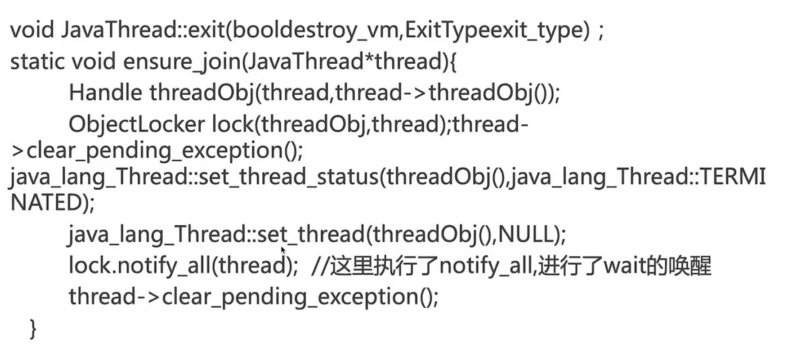

# 深入浅出Java并发多线程

[toc]

## 第7章、趣解Thread类和Object类中线程相关方法

Join

作用：因为新的线程加入了我们，所以我们要等它执行完再出发。

用法：main等待thread1执行完毕，注意谁等谁。

```java
public class JoinExample {
    public static void main(String[] args) {
//        mainWaitOtherThreads();
//        testInterrupt();
//        testJoinThreadState();
//        testJoinEquivalence();
    }

    /**
     * This method is to describe the other way to implement the join method effect.
     *
     * <result>
     * Main thread current state: TIMED_WAITING
     * Main thread current state: RUNNABLE
     * <result/>
     */
    private static void testJoinEquivalence() {
        Thread mainThread = Thread.currentThread();

        Thread childThread = new Thread(() -> {
            try {
                // If the join method params is 1000 > 0 and the main thread state is TIMED_WAITING.
                // If the join method params is 0 and the main thread state is WAITING.
                System.out.println("Main thread current state: " + mainThread.getState());
                Thread.sleep(3000);
            } catch (InterruptedException e) {
                System.out.println(Thread.currentThread().getName() + " was interrupted.");
            }
        },"child_thread");


        try {
            childThread.start();
//            childThread.join(1000);
            synchronized (childThread){
                childThread.wait(1000);
            }
            System.out.println("Main thread current state: " + mainThread.getState());
        } catch (InterruptedException e) {
            System.out.println(Thread.currentThread().getName() + " was interrupted.");

        }
    }

    /**
     * When other threads join in main thread which state is WAITING(PS:It's no BLOCKED)
     *
     * <result>
     * Main thread current state: WAITING
     * Main thread current state: RUNNABLE
     * <result/>
     */
    private static void testJoinThreadState() {
        Thread mainThread = Thread.currentThread();

        Thread childThread = new Thread(() -> {
            try {
                // If the join method params is 1000 > 0 and the main thread state is TIMED_WAITING.
                // If the join method params is 0 and the main thread state is WAITING.
                System.out.println("Main thread current state: " + mainThread.getState());
                Thread.sleep(3000);
            } catch (InterruptedException e) {
                System.out.println(Thread.currentThread().getName() + " was interrupted.");
            }
        },"child_thread");


        try {
            childThread.start();
            childThread.join(1000);
            System.out.println("Main thread current state: " + mainThread.getState());
        } catch (InterruptedException e) {
            System.out.println(Thread.currentThread().getName() + " was interrupted.");

        }
    }

    /**
     * <result>
     * Main thread is waiting for join_thread to complete.
     * join_thread begin...
     * main was interrupted.
     * Main thread completed.
     * join_thread was interrupted.
     * join_thread ending...
     * <result/>
     */
    private static void testInterrupt() {
        Thread mainThread = Thread.currentThread();

        Thread childThread = new Thread(() -> {
            System.out.println(Thread.currentThread().getName() + " begin...");
            try {
                mainThread.interrupt();
                Thread.sleep(5000);
            } catch (InterruptedException e) {
                System.out.println(Thread.currentThread().getName() + " was interrupted.");
            }
            System.out.println(Thread.currentThread().getName() + " ending...");
        }, "join_thread");

        System.out.println("Main thread is waiting for " + childThread.getName() + " to complete.");
        try {
            childThread.start();
            childThread.join();
        } catch (InterruptedException e) {
            System.out.println(Thread.currentThread().getName() + " was interrupted.");
            childThread.interrupt();
        }
        System.out.println("Main thread completed.");
    }


    /**
     * Test the main thread that waiting to thread1 and thread2 to complete.
     *
     * <result>
     * Main Thread mark Beginning...
     * thread1
     * thread2
     * Main Thread mark ending...
     * <result/>
     */
    private static void mainWaitOtherThreads() {
        System.out.println("Main Thread mark Beginning...");
        Thread thread1 = new Thread(() -> System.out.println(Thread.currentThread().getName()), "thread1");
        Thread thread2 = new Thread(() -> System.out.println(Thread.currentThread().getName()), "thread2");
        thread1.start();
        thread2.start();
        try {
            thread1.join();
            thread2.join();
        } catch (InterruptedException e) {
            e.printStackTrace();
        }
        System.out.println("Main Thread mark ending... ");
    }

}
```


Join源码解析

```java
/**                                                                          
 * Waits at most {@code millis} milliseconds for this thread to              
 * die. A timeout of {@code 0} means to wait forever.                        
 *                                                                           
 * <p> This implementation uses a loop of {@code this.wait} calls            
 * conditioned on {@code this.isAlive}. As a thread terminates the           
 * {@code this.notifyAll} method is invoked. It is recommended that          
 * applications not use {@code wait}, {@code notify}, or                     
 * {@code notifyAll} on {@code Thread} instances.                            
 *                                                                           
 * @param  millis                                                            
 *         the time to wait in milliseconds                                  
 *                                                                           
 * @throws  IllegalArgumentException                                         
 *          if the value of {@code millis} is negative                       
 *                                                                           
 * @throws  InterruptedException                                             
 *          if any thread has interrupted the current thread. The            
 *          <i>interrupted status</i> of the current thread is               
 *          cleared when this exception is thrown.                           
 */                                                                          
// BEGIN Android-changed: Synchronize on separate lock object not this Thread
// public final synchronized void join(long millis)                          
public final void join(long millis)                                          
throws InterruptedException {                                                
    synchronized(lock) {                                                     
    long base = System.currentTimeMillis();                                  
    long now = 0;                                                            
                                                                             
    if (millis < 0) {                                                        
        throw new IllegalArgumentException("timeout value is negative");     
    }                                                                        
                                                                             
    if (millis == 0) {                                                       
        while (isAlive()) {                                                  
            lock.wait(0);                                                    
        }                                                                    
    } else {                                                                 
        while (isAlive()) {                                                  
            long delay = millis - now;                                       
            if (delay <= 0) {                                                
                break;                                                       
            }                                                                
            lock.wait(delay);                                                
            now = System.currentTimeMillis() - base;                         
        }                                                                    
    }                                                                        
    }                                                                        
}                                                                            
// END Android-changed: Synchronize on separate lock object not this Thread. 
```

从注释可以看出，join传入参数mills大于0时，表示被join线程需要wait mills这么多秒的时间；如果传入参数等于0，则被join线程会一直处于wait状态，直到join线程终止。注意：join中的代码片段都是在被join的线程之中执行的。


疑问：

从join的源码中可以看出，join方法中没有执行了wait却没有执行notify的操作，那究竟是谁执行了这个唤醒操作呢？



如上图所示，需要深入到JVM层去研究。实际上，每个thread类的run方法执行完成以后会自动的执行notify的操作。

由此可以得出，thread.join方法的等价代码

```java
synchronized(thread){
	thread.wait();
}
```

为什么这里的同步对象必须是thread，用其他的对象不行？

在join期间，线程处于哪种线程状态？


yield方法详解

作用：释放我的CPU时间片

定位：JVM不保证遵循

yield和sleep区别：是否随时可能再次被调度


