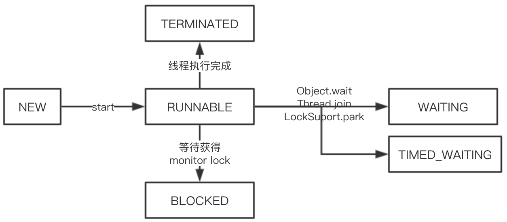
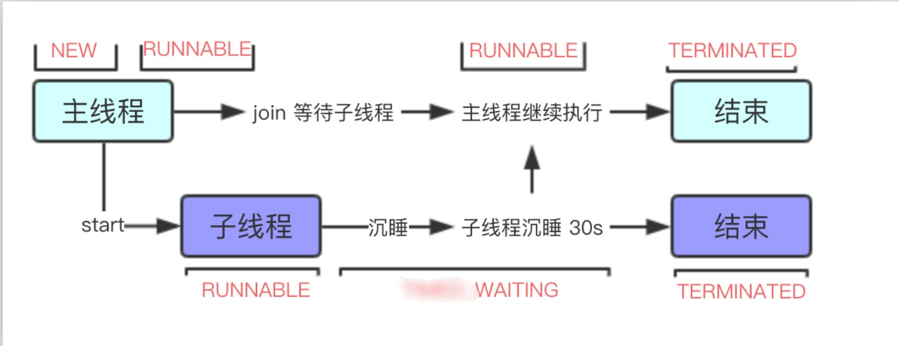

[toc]

# 线程

线程是什么

> 线程是进程中的单一顺序的控制流。一个进程中可以并发多个线程，每条线程并且执行任务。

进程是什么

> 进程包括操作系统分配的内存空间，包含一个或多个线程。一个线程是不能独立存在的，它必须是进程的一部分。一个进程一直运行，知道所有的非守护线程都结束运行后才能结束。


线程基本特征

- 每个线程都有优先级概念，具有较高优先级的线程倾向于较低优先级线程执行，注意这里只是倾向，并非绝对；
- 父线程创建子线程后，优先级、是否是守护线程等属性与父子线程是一致的；
- JVM启动时，通常只有一个非守护线程（main）。发生以下情况时会导致JVM退出，
  - 调用了Runtime#exit()方法，并且安全管理器已允许进行退出操作；
  - 所有非守护线程都消亡，或者从run方法正常返回，或者run方法抛出了异常。


线程基本概念

线程状态

从Thread类的内部枚举类State可以看出，线程一共有六种状态。如下所示：

- **NEW：**尚未启动的线程，也就是调用了new Thread方法之后的状态。

- **RUNNABLE：**可运行线程的线程状态。 处于可运行状态的线程正在Java虚拟机中执行，但是它可能正在等待来自操作系统（例如处理器）的其他资源。

- **BLOCKED：**线程处于BLOCKED状态。表示线程正在等待进入同步代码块/方法或者当线程调用了Object.wait方法以后，线程正在等待重新进入同步代码块/方法

- **WAITING：**线程处于waiting状态可能由于调用了以下的这些方法，

  - Object#wait();
  - Thread#join();
  - LockSupport#park();

  当线程处于WAITING状态时，需要另外的线程做出动作才能解除线程的WAITING状态。例如，线程调用了Object#wait()，那么此线程就在等待另外一个线程调用Object#notify()或者Object#notifyAll()；一个线程调用了Thread#join()，则需要等到被调用线程运行终止。

- **TIMED_WAITING：**调用如下方法（入参为正数）会使线程处于TIMED_WAITING状态，

  - Thread#sleep();
  - Object#wait();
  - Thread#join();
  - LockSupport#parkNanos();
  - LockSupport#parkUntil();

- **TERMINATED：**线程执行结束时的状态。

线程状态转换图



线程状态源码

```java
/**
  * A thread can be in only one state at a given point in time.
  * These states are virtual machine states which do not reflect
  * any operating system thread states.
  */
public enum State {
        /**
         * Thread state for a thread which has not yet started.
         */
        NEW,

        /**
         * Thread state for a runnable thread.  A thread in the runnable
         * state is executing in the Java virtual machine but it may
         * be waiting for other resources from the operating system
         * such as processor.
         */
        RUNNABLE,

        /**
         * Thread state for a thread blocked waiting for a monitor lock.
         * A thread in the blocked state is waiting for a monitor lock
         * to enter a synchronized block/method or
         * reenter a synchronized block/method after calling
         * {@link Object#wait() Object.wait}.
         */
        BLOCKED,

        /**
         * Thread state for a waiting thread.
         * A thread is in the waiting state due to calling one of the
         * following methods:
         * <ul>
         *   <li>{@link Object#wait() Object.wait} with no timeout</li>
         *   <li>{@link #join() Thread.join} with no timeout</li>
         *   <li>{@link LockSupport#park() LockSupport.park}</li>
         * </ul>
         *
         * <p>A thread in the waiting state is waiting for another thread to
         * perform a particular action.
         *
         * For example, a thread that has called <tt>Object.wait()</tt>
         * on an object is waiting for another thread to call
         * <tt>Object.notify()</tt> or <tt>Object.notifyAll()</tt> on
         * that object. A thread that has called <tt>Thread.join()</tt>
         * is waiting for a specified thread to terminate.
         */
        WAITING,

        /**
         * Thread state for a waiting thread with a specified waiting time.
         * A thread is in the timed waiting state due to calling one of
         * the following methods with a specified positive waiting time:
         * <ul>
         *   <li>{@link #sleep Thread.sleep}</li>
         *   <li>{@link Object#wait(long) Object.wait} with timeout</li>
         *   <li>{@link #join(long) Thread.join} with timeout</li>
         *   <li>{@link LockSupport#parkNanos LockSupport.parkNanos}</li>
         *   <li>{@link LockSupport#parkUntil LockSupport.parkUntil}</li>
         * </ul>
         */
        TIMED_WAITING,

        /**
         * Thread state for a terminated thread.
         * The thread has completed execution.
         */
        TERMINATED;
    }
```


线程优先级

从Thread类的注释表明，每个线程都有一个优先级。线程优先级高的倾向于比线程优先级低的线程先执行，注意，这里只是倾向于先执行，不是一定先执行。

在线程创建过程中，并且没有明确指定线程优先级时，新建线程的优先级与父线程优先级保持一致。

```
/**
 * The minimum priority that a thread can have.
 */
public final static int MIN_PRIORITY = 1;

**
 * The default priority that is assigned to a thread.
 */
public final static int NORM_PRIORITY = 5;

/**
 * The maximum priority that a thread can have.
 */
public final static int MAX_PRIORITY = 10;
```

守护线程

守护线程是什么

守护线程时用来为非守护线程服务的，守护线程的优先级很低。当Java虚拟机退出时，不会关心是否还有守护线程在运行。一般用于一些监控、垃圾回收，如GC。

守护线程测试代码

```java
/**
 * 在不使用setDaemon方法设置线程是否是守护线程时，子线程的Daemon属性与父线程的Daemon属性相同。
 *
 * <result>
 * name: parent priority: 5 and daemon: true
 * name: child priority: 5 and daemon: true
 * <result/>
 */
@Test
public void testThreadPriority() {
    Thread parent = new Thread("parent") {
        @Override
        public void run() {
            System.out.println("name: " + getName() + " priority: " + getPriority() + " and daemon: "
                    + isDaemon());

            Thread child = new Thread("child") {
                @Override
                public void run() {
                    System.out.println("name: " + getName() + " priority: " + getPriority() + " and daemon: "
                            + isDaemon());
                }
            };
            child.start();
        }
    };
    parent.setDaemon(true);
    parent.start();
}
```


线程创建方式

有两种方法可以创建新的执行线程。

-  一种是将一个类声明为Thread的子类。 该子类应重写Thread类的run方法。 然后可以分配并启动子类的实例。 例如，一个计算素数大于指定值的线程可以编写如下：

  ```java
  class PrimeThread extends Thread {            
      long minPrime;                            
      PrimeThread(long minPrime) {              
          this.minPrime = minPrime;             
      }                                         
                                                
      public void run() {                       
          // compute primes larger than minPrime
          &nbsp;.&nbsp;.&nbsp;.                 
      }                                         
  }                                             
  ```

- 另外一种方法是声明一个实现Runnable接口的类，实现Runnable中的run方法。在创建Thread时将其作为参数传递并启动。

  ```java
  class PrimeRun implements Runnable {          
      long minPrime;                            
      PrimeRun(long minPrime) {                 
          this.minPrime = minPrime;             
      }                                         
                                                
      public void run() {                       
          // compute primes larger than minPrime
          &nbsp;.&nbsp;.&nbsp;.                 
      }                                         
  }                                             
  ```

  

线程常规操作

初始化

从Thread构造函数可以看到，线程初始化过程只是对线程的基本属性进行配置，并没有执行真正的任务。此时线程的状态是NEW。

```java
private void init(ThreadGroup g, Runnable target, String name,
                  long stackSize, AccessControlContext acc) {
    if (name == null) {
        throw new NullPointerException("name cannot be null");
    }

    this.name = name.toCharArray();

    Thread parent = currentThread();
    SecurityManager security = System.getSecurityManager();
    if (g == null) {
        /* Determine if it's an applet or not */

        /* If there is a security manager, ask the security manager
           what to do. */
        if (security != null) {
            g = security.getThreadGroup();
        }

        /* If the security doesn't have a strong opinion of the matter
           use the parent thread group. */
        if (g == null) {
            g = parent.getThreadGroup();
        }
    }

    /* checkAccess regardless of whether or not threadgroup is
       explicitly passed in. */
    g.checkAccess();

    /*
     * Do we have the required permissions?
     */
    if (security != null) {
        if (isCCLOverridden(getClass())) {
            security.checkPermission(SUBCLASS_IMPLEMENTATION_PERMISSION);
        }
    }

    g.addUnstarted();

    this.group = g;
    // 继承父线程守护线程属性
    this.daemon = parent.isDaemon();
    // 继承父线程优先级
    this.priority = parent.getPriority();
    if (security == null || isCCLOverridden(parent.getClass()))
        this.contextClassLoader = parent.getContextClassLoader();
    else
        this.contextClassLoader = parent.contextClassLoader;
    this.inheritedAccessControlContext =
            acc != null ? acc : AccessController.getContext();
    this.target = target;
    setPriority(priority);
    // 当父线程中的inheritableThreadLocals不为空时，
    // 会把inheritableThreadLocals的值全部传递给子线程
    if (parent.inheritableThreadLocals != null)
        this.inheritableThreadLocals =
            ThreadLocal.createInheritedMap(parent.inheritableThreadLocals);
    /* Stash the specified stack size in case the VM cares */
    this.stackSize = stackSize;

    /* Set thread ID */
    tid = nextThreadID();
}
```

线程启动 -- Start

在start方法中做了两件事，分别是

- 检查该线程是否已经被启动过，如果已经被启动过，则会抛出异常IllegalThreadStateException；
- 调用start0这个native方法，完成线程的启动工作。

```java
/**
 * Causes this thread to begin execution; the Java Virtual Machine
 * calls the <code>run</code> method of this thread.
 * <p>
 * The result is that two threads are running concurrently: the
 * current thread (which returns from the call to the
 * <code>start</code> method) and the other thread (which executes its
 * <code>run</code> method).
 * <p>
 * It is never legal to start a thread more than once.
 * In particular, a thread may not be restarted once it has completed
 * execution.
 *
 * @exception  IllegalThreadStateException  if the thread was already
 *               started.
 * @see        #run()
 * @see        #stop()
 */
public synchronized void start() {
    /**
     * This method is not invoked for the main method thread or "system"
     * group threads created/set up by the VM. Any new functionality added
     * to this method in the future may have to also be added to the VM.
     *
     * A zero status value corresponds to state "NEW".
     */
    if (threadStatus != 0)
        throw new IllegalThreadStateException();

    /* Notify the group that this thread is about to be started
     * so that it can be added to the group's list of threads
     * and the group's unstarted count can be decremented. */
    group.add(this);

    boolean started = false;
    try {
        start0();
        started = true;
    } finally {
        try {
            if (!started) {
                group.threadStartFailed(this);
            }
        } catch (Throwable ignore) {
            /* do nothing. If start0 threw a Throwable then
              it will be passed up the call stack */
        }
    }
}

private native void start0();
```


join方法

参数解析：

join方法入参表示调用线程需要等待的时长，单位是毫秒。但如果传入参数是0，则表示调用线程需要一直等待，直到被调用线程终止。

方法说明：

join方法的实现是依靠wait方法的循环来达到使调用线程等待。分别包括两段逻辑，

- mills == 0，表示调用线程需要等到被调用线程执行完毕；
- mills > 0，表示调用线程最长等待时间为mills，如果被调用线程在mills时间以内任务执行完毕，会调用Object#notifyAll方法，所以这里说的是最长等待时间是mills。

```java
/**
* Waits at most {@code millis} milliseconds for this thread to
* die. A timeout of {@code 0} means to wait forever.
*
* <p> This implementation uses a loop of {@code this.wait} calls
* conditioned on {@code this.isAlive}. As a thread terminates the
* {@code this.notifyAll} method is invoked. It is recommended that
* applications not use {@code wait}, {@code notify}, or
* {@code notifyAll} on {@code Thread} instances.
*
* @param  millis
*         the time to wait in milliseconds
*
* @throws  IllegalArgumentException
*          if the value of {@code millis} is negative
*
* @throws  InterruptedException
*          if any thread has interrupted the current thread. The
*          <i>interrupted status</i> of the current thread is
*          cleared when this exception is thrown.
*/
public final synchronized void join(long millis) throws InterruptedException {
    long base = System.currentTimeMillis();
    long now = 0;

    if (millis < 0) {
        throw new IllegalArgumentException("timeout value is negative");
    }

    if (millis == 0) {
        while (isAlive()) {
            wait(0);
        }
    } else {
        while (isAlive()) {
            long delay = millis - now;
            if (delay <= 0) {
                break;
            }
            wait(delay);
            now = System.currentTimeMillis() - base;
        }
    }
}
```

方法示例：

```
/**
 * <result>
 * time: Sun Jan 31 11:58:54 CST 2021 threadName: main
 * main thread state: WAITING
 * time: Sun Jan 31 11:58:54 CST 2021 threadName: Thread-0
 * time: Sun Jan 31 11:59:04 CST 2021 threadName: Thread-0
 * time: Sun Jan 31 11:59:04 CST 2021 threadName: main<result/>
 */
@Test
public void testJoin() {
    Thread mainThread = Thread.currentThread();
    System.out.println("time: " + new Date() + " threadName: " + mainThread.getName());
    Thread childThread = new Thread(() -> {
        try {
            System.out.println("main thread state: " + mainThread.getState());
            System.out.println("time: " + new Date() + " threadName: " + Thread.currentThread().getName());
            Thread.sleep(10000L);
            System.out.println("time: " + new Date() + " threadName: " + Thread.currentThread().getName());
        } catch (InterruptedException e) {
            e.printStackTrace();
        }
    });
    try {
        // 开一个子线程去执行
        childThread.start();
        // 当前主线程等待子线程执行完成之后再执行
        childThread.join();
    } catch (InterruptedException e) {
        e.printStackTrace();
    }
    System.out.println("time: " + new Date() + " threadName: " + Thread.currentThread().getName());
}
```

以上测试代码的线程状态转换如下图所示：




yield方法

yield方法会给CPU调度器发出指示，当前线程愿意放弃对CPU的使用。不过这个并不代表当前线程就不继续执行了，CPU在调度过程中可能重新选择执行该线程。

```java
/**
 * A hint to the scheduler that the current thread is willing to yield
 * its current use of a processor. The scheduler is free to ignore this
 * hint.
 *
 * <p> Yield is a heuristic attempt to improve relative progression
 * between threads that would otherwise over-utilise a CPU. Its use
 * should be combined with detailed profiling and benchmarking to
 * ensure that it actually has the desired effect.
 *
 * <p> It is rarely appropriate to use this method. It may be useful
 * for debugging or testing purposes, where it may help to reproduce
 * bugs due to race conditions. It may also be useful when designing
 * concurrency control constructs such as the ones in the
 * {@link java.util.concurrent.locks} package.
 */
public static native void yield();
```


sleep方法

该方法会暂停线程的执行，并且不会释放当前线程所持有的锁。

```java
/**
 * The thread does not lose ownership of any monitors.
 */
public static void sleep(long millis, int nanos)
throws InterruptedException {
    if (millis < 0) {
        throw new IllegalArgumentException("timeout value is negative");
    }

    if (nanos < 0 || nanos > 999999) {
        throw new IllegalArgumentException(
                            "nanosecond timeout value out of range");
    }

    if (nanos >= 500000 || (nanos != 0 && millis == 0)) {
        millis++;
    }

    sleep(millis);
}
```


interrupt方法

```java
/**
 * Interrupts this thread.
 */
public void interrupt() {
    if (this != Thread.currentThread())
        checkAccess();

    synchronized (blockerLock) {
        Interruptible b = blocker;
        if (b != null) {
            interrupt0();           // Just to set the interrupt flag
            b.interrupt(this);
            return;
        }
    }
    interrupt0();
}

private native void interrupt0();
```

该方法的作用是中断正在运行的线程，在如下这些情景将会发生线程中断的情况：

- 如果调用了Object#wait()、Thread#join()、Thread#sleep()、如果此时线程被中断执行，将会抛出InterruptedException。
- 如果线程在InterruptibleChannel的I / O操作中被阻塞，则该通道将关闭，该线程的中断状态将被设置，并且该线程将收到java.nio.channels.ClosedByInterruptException 。
- 如果此线程在java.nio.channels.Selector被阻塞，则将设置该线程的中断状态，并且它将立即从选择操作中返回（可能具有非零值），就像调用选择器的wakeup方法一样

代码示例：

```java
/**
 * <result>
 * child begin...
 * child was interrupted.
 * <result/>
 */
@Test
public void testInterrupt() {
    Thread child = new Thread(() -> {
        System.out.println(Thread.currentThread().getName() + " begin...");
        try {
            Thread.sleep(10000);
        } catch (InterruptedException e) {
            System.out.println(Thread.currentThread().getName() + " was interrupted.");
        }
    }, "child");
    child.start();
    try {
        Thread.sleep(1000);
        if (child.isAlive()) {
            child.interrupt();
        }
    } catch (InterruptedException e) {
        System.out.println(Thread.currentThread().getName() + " was interrupted.");
    }
}
```


带返回值的线程任务

示例代码：

```java
/**
 * <result>
 *     Product made in child thread.
 * </result>
 */
@Test
public void testThreadWithReturnValue() {
    ThreadPoolExecutor threadPoolExecutor = new ThreadPoolExecutor(3, 3,
            0L, TimeUnit.MILLISECONDS, new LinkedBlockingQueue<>());
    FutureTask<String> futureTask = new FutureTask<>(() -> "Product made in child thread.");
    threadPoolExecutor.submit(futureTask);
    try {
        String childResult = futureTask.get();
        System.out.println(childResult);
    } catch (InterruptedException | ExecutionException e) {
        e.printStackTrace();
    }
}
```

代码说明：

- Callable定义我们需要做的事情，是可以有返回值的；
- FutureTask我们叫做任务，入参是Callable，是对Callable的封装，方便线程池的使用；
- 通过FutureTask#get()得到子线程的结果。


线程相关类

Callable

Callable是接口，其功能和Runnable类似，两者都是用来定义任务，由另外的线程来执行。但Callable可以返回值给到调用线程并且可以抛出检测异常。

```java
/**
 * <p>The {@code Callable} interface is similar to {@link
 * java.lang.Runnable}, in that both are designed for classes whose
 * instances are potentially executed by another thread.  A
 * {@code Runnable}, however, does not return a result and cannot
 * throw a checked exception.
 *
 * @param <V> the result type of method {@code call}
 */
@FunctionalInterface
public interface Callable<V> {
    /**
     * Computes a result, or throws an exception if unable to do so.
     *
     * @return computed result
     * @throws Exception if unable to compute a result
     */
    V call() throws Exception;
}
```

FutureTask

定义

```java
/**
 * @param <V> The result type returned by this FutureTask's {@code get} methods
 */
public class FutureTask<V> implements RunnableFuture<V> {
}
```

FutureTask作用

- 开始或取消任务；
- 查询任务是否完成，如果尚未完成，则get方法将阻塞调用线程；
- 包装Callable或Runnable对象，因为FutureTask实现了Runnable，因此可以让线程池执行任务。

FutureTask源码解析

构造函数

FutureTask存在两个构造函数，一个入参是Callable，一个入参是Runnable。在构造函数中完成对callable以及state的初始化

```java
public FutureTask(Callable<V> callable) {
    if (callable == null)
        throw new NullPointerException();
    this.callable = callable;
    this.state = NEW;       // ensure visibility of callable
}

public FutureTask(Runnable runnable, V result) {
    this.callable = Executors.callable(runnable, result);
    this.state = NEW;       // ensure visibility of callable
}
```

其中入参为Runnable的，FutureTask将其转换为Callable，转换方式是返回一个RunnableAdapter，代码如下

```java
/**
 * A callable that runs given task and returns given result
 */
static final class RunnableAdapter<T> implements Callable<T> {
    final Runnable task;
    final T result;
    RunnableAdapter(Runnable task, T result) {
        this.task = task;
        this.result = result;
    }
    public T call() {
        task.run();
        return result;
    }
}
```

- RunnableAdapter实现了Callable，所以RunnableAdapter就是Callable;
- Runnable是RunnableAdapter的一个属性，在构造RunnableAdapter的时候会传进来，并且在Callable的call方法中调用了Runnable的run方法。

这个是典型的适配模式。


RunnableFuture

RunnableFuture接口的最大目的是让Future可以对Runnable进行管理，可以取消Runnable，查看Runnable是否完成。

```java
/**
 * A {@link Future} that is {@link Runnable}. Successful execution of
 * the {@code run} method causes completion of the {@code Future}
 * and allows access to its results.
 * @param <V> The result type returned by this Future's {@code get} method
 */
public interface RunnableFuture<V> extends Runnable, Future<V> {
    /**
     * Sets this Future to the result of its computation
     * unless it has been cancelled.
     */
    void run();
}
```

Future

- Future表示异步计算的结果。 可以用来检查计算是否完成，等待其完成以及获取计算结果。

- 只有在计算完成后才可以使用get方法检索结果，必要时将其阻塞，直到准备就绪为止。 

- 取消通过cancel方法执行。 提供了其他方法来确定任务是正常完成还是被取消。

-  一旦计算完成，就不能取消计算。

-  如果出于可取消性的目的而使用Future而不提供可用的结果，则可以声明Future<?>形式的类型，并作为基础任务的结果返回null 。

```java
ublic interface Future<V> {

    // 该函数功能为尝试取消任务。
    // 任务已经完成或任务已经被取消或者由于其他原因任务不能被取消，就会返回false。
    // 任务没有被执行时取消返回true。
    // 如果任务正在运行，mayInterruptIfRunning为ture的话，就可以打断运行中的线程，如果
    // mayInterrruptIfRunning为false，表示不能打断直接返回。
    boolean cancel(boolean mayInterruptIfRunning);

    // 如果此任务在正常完成之前被取消，则返回true。
    boolean isCancelled();

    // 如果任务执行完成则返回true。
    // 任务执行完成可能是正常完成、发生异常、或者取消，这些情况都是返回false。
    boolean isDone();

    // 等待任务执行结果返回。
    V get() throws InterruptedException, ExecutionException;

    // 等待任务执行结果返回，但有超时时间限制，如果超时没有响应就会抛出TimeoutException。
    V get(long timeout, TimeUnit unit)
        throws InterruptedException, ExecutionException, TimeoutException;
}
```

